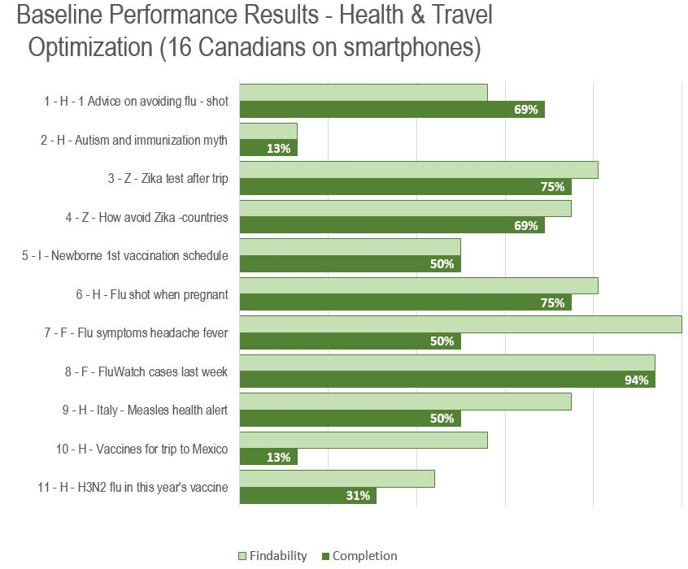
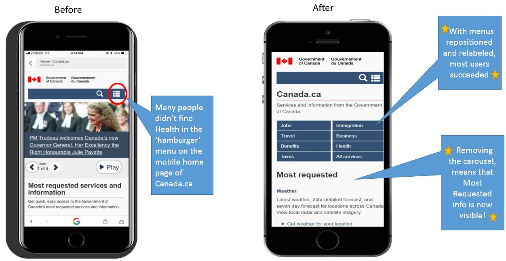
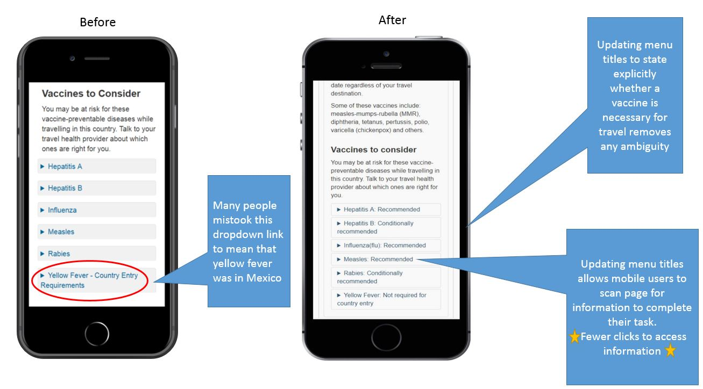
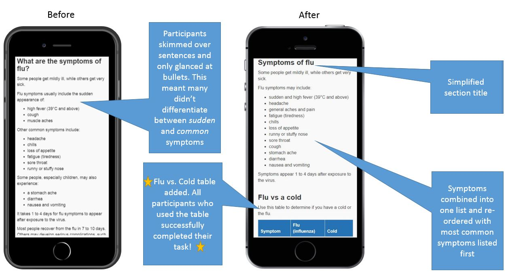

Website optimization is a process of systematically improving the performance of the website (structure, flow, and content organization) to meet a particular objective. The optimization of top tasks is a way to focus attention on what's most important - how people use that content. The purpose of our optimization project with our partners at Health Canada (HC) and the Public Health Authority of Canada (PHAC) is to help users complete their tasks quickly and successfully. 

This doesn't mean that we're creating new policies or services, but we're shifting the focus from how the organization thinks about their service (what we're doing and how we're doing it) to how the visitor consumes it (ensuring they can actually apply, understand the guidance to comply or make safe or healthy decisions, which in turn contribute to policy outcomes and change for Canadians).

That doesn't guarantee success of course. But it puts you in the right position to manage content in a way that focuses on the people who use it. 

This article looks at a sample of baseline testing results from a recent usability (UX) test of several top tasks for HC and PHAC. The examples below were chosen because they demonstrated some of the most common behaviours shown by participants in the study.
 
* [What Really Matters: Focusing on Top Tasks](https://alistapart.com/article/what-really-matters-focusing-on-top-tasks)
* [How to conduct a top task analysis](https://measuringu.com/top-tasks/)

 

## Baseline Test Results - How successful were people at completing their tasks?

To find out how sucessful people were at finding the correct information and being able to complete their task we ran a usability (UX) test that asked the participants to complete a series of tasks. The test looked at three main things (1) Was the participant able to find the correct information, (2) Was the participant able to successfully complete their task, (3) What path did they follow in their attempt to find the correct information.

The participants were asked to complete 11 tasks. Each task had to be completed within five minutes and the participant had to record their answer to the task. 

 
<ul>
<li> Q1.
This year's flu season could be worse than usual. Find the government’s advice on the most important way to avoid getting the flu. </li>
 
<li> Q2.
Your friend put up a post urging her friends not to vaccinate their kids because of the risk of autism. Find some answers that would make you feel ready to discuss it with her. </li>
 
<li> Q3. You got a few mosquito bites on your honeymoon down south but you feel fine. Before getting pregnant, you want to make sure you don’t have Zika. Is there a test that can tell if you're infected? </li>
 
<li> Q4. You plan to start a family soon, but want a sunny vacation first. Which of the countries below should you avoid because of the risk of Zika? </li>
 
<li> Q5. Your baby was born on the first of this month. At what age is the first set of vaccinations recommended? </li>
 
<li> Q6. It is flu season and a family member is pregnant. Find out whether or not she should get a flu shot while pregnant. </li> 
 
<li> Q7. You don't want to miss work tomorrow but should stay away if you have the flu. Yesterday, all of the symptoms below hit - find out which ones are the signal that it's the flu. </li>
 
<li> Q8. Find out whether the number of cases of flu last week were higher or lower than usual, to help you decide if you should get a flu shot now or wait. </li>
 
 <li> Q9. You think you heard something on the news about people being sick in Italy. Is there a particular concern you should be aware of before you go with your baby? </li>
 
<li> Q10. You are planning a trip to Mexico. Which specific vaccinations are recommended before you go? </li>
 
<li> Q11. The weekly flu report says most cases are an H3N2 flu. Find out if that particular flu is in this year's vaccine in Canada to help persuade your partner to get a flu shot.</li>
</ul>
  

The following chart compares the baseline test scores for findability with the task completion score for all eleven questions posed to participants.

 

      

          
 
      

  
 
  

 
 
## Common issues for mobile users

Many people didn’t find Health in the ‘hamburger’menu on the mobile home page of Canada.ca – so if their search failed, they tended to fail the task.

 

 

      

          
       
      

 
 

Recommendation: make the menu items as visible in the mobile view as they are in the desktop view. 

 

## Writing meaninful titles and descriptions

One of the hard things about writing tasks is tayloring your word choice to a non-specialist audience. To increase the findability of your content it is important to encorporate commonly used search terms into your section titles and web content instead of focusing on using scientific lingo or profession-specific jargon. 

Our UX study demonstrated that users often overlooked a link that would have taken them to the correct information because they didn't recognize the title of that link or section as being useful for completing their task. In the example below, we see that people misunderstood this list – most answered incorrectly that they should get the Yellow Fever vaccine to visit Mexico.  Only a few opened it to see that it is not recommended for Mexico.

 

  
 

          
 
      

 
Recommendation: change list titles so that recommendations are visible on first glance. 

 
 

 
## Displaying information meaningfully 

Half of the people incorrectly answered that a cough was one of the most important signals that someone had the flu rather than a cold. In this case, they missed two of the three bullets that listed the most common flu symptoms. For this scenario, the participants that successfully completed the task were those that found the flu vs. cold table which was located further down the page. The task highlights that how information is displayed can have a significant impact on task completion. Although the information they needed was at the top of the page in bulleted form, it was only those that saw the table comparing the symptoms of flus versus colds that were able to complete their task successfully.

The image below shows an example of the what the users saw on their mobile devices that resulted in them choosing the incorrect answer to their task. Many users saw this information and failed to scroll further down the page to find the chart.

 

 

      

          
       
       

        

 
Recommendation: add the table of flu versus cold to the top of this page – people who found it got the answer correct. 

 

## Find out more

We’re happy to share what we’ve learned. If you’ve got questions, email us at ux.eu@tbs-sct.gc.ca

## Explore further

* [Top task management on Canada.ca]() presents the methodology we use to identify and manage the top 100 tasks for Canada.ca
* [Making Canada.ca for Canadians]() gives an overview of how we originally used the top 100 tasks in 2013 to design Canada.ca navigation
* [How we're optimizing top tasks on Canada.ca](https://canada-ca.github.io/category/2017/08/21/optimization-overview.html) shares more about how we're focusing now on improving specific top tasks on Canada.ca
* [What Really Matters: Focusing on Top Tasks](https://alistapart.com/article/what-really-matters-focusing-on-top-tasks) is a great article from Gerry McGovern on the value of top tasks and the survey voting method to validate them
* [New Thinking](http://gerrymcgovern.com/new-thinking/) is where Gerry McGovern posts weekly on a range of top task management and digital transformation themes 
* [How to conduct a top task analysis](https://measuringu.com/top-tasks/) from Jeff Sauro gets into some of the statistical details around analysing top task data from surveys

